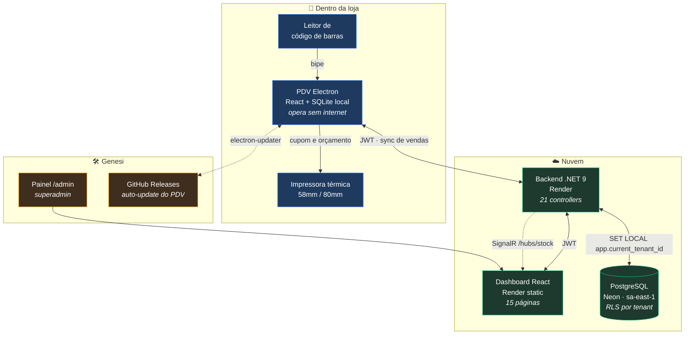
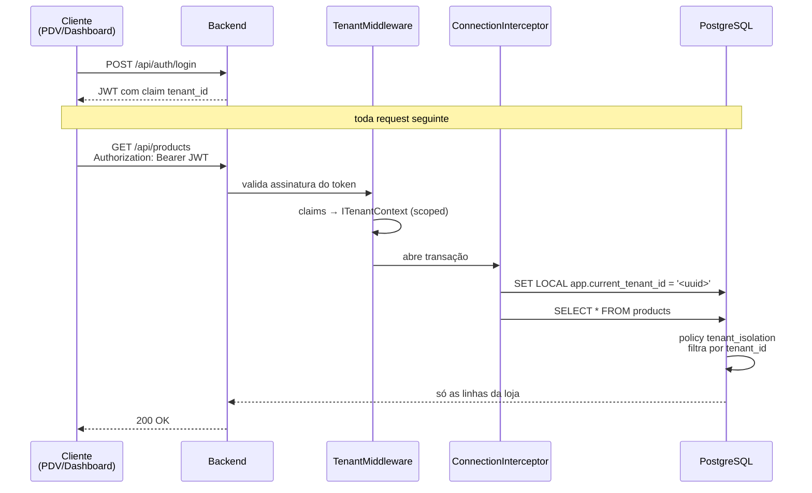
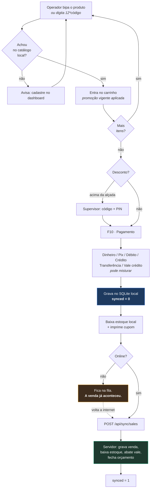
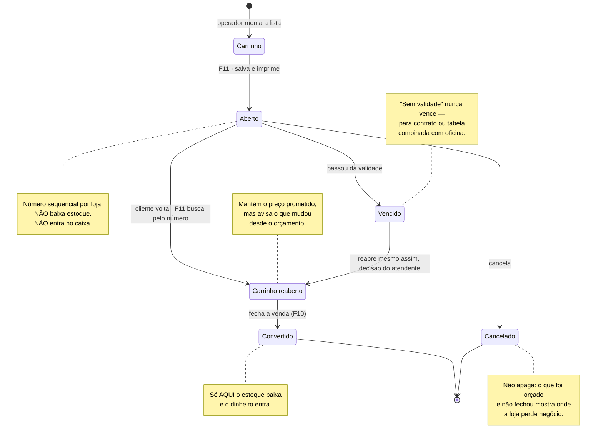
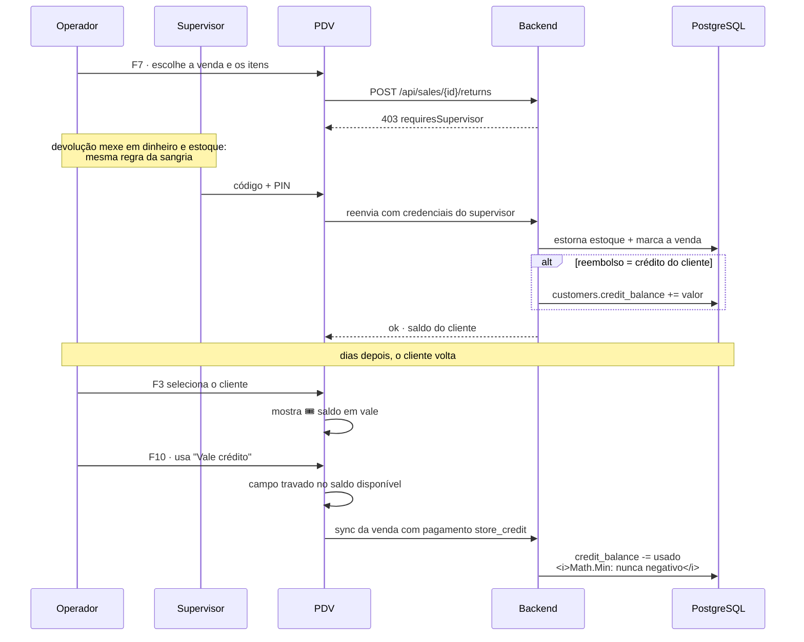
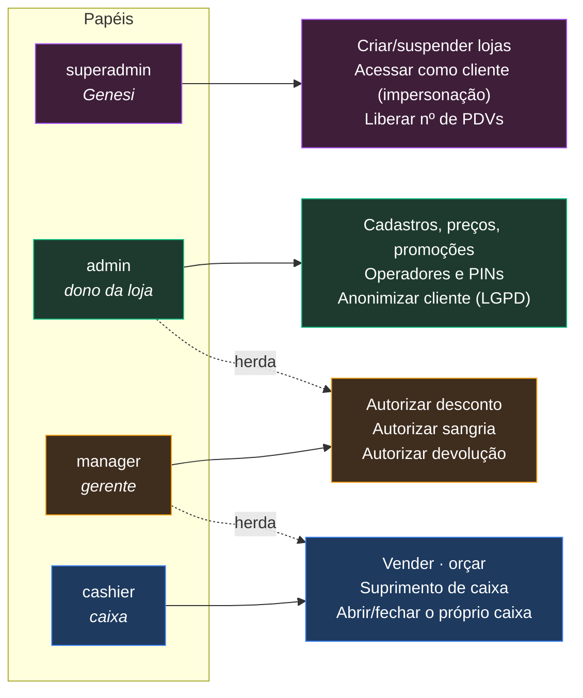
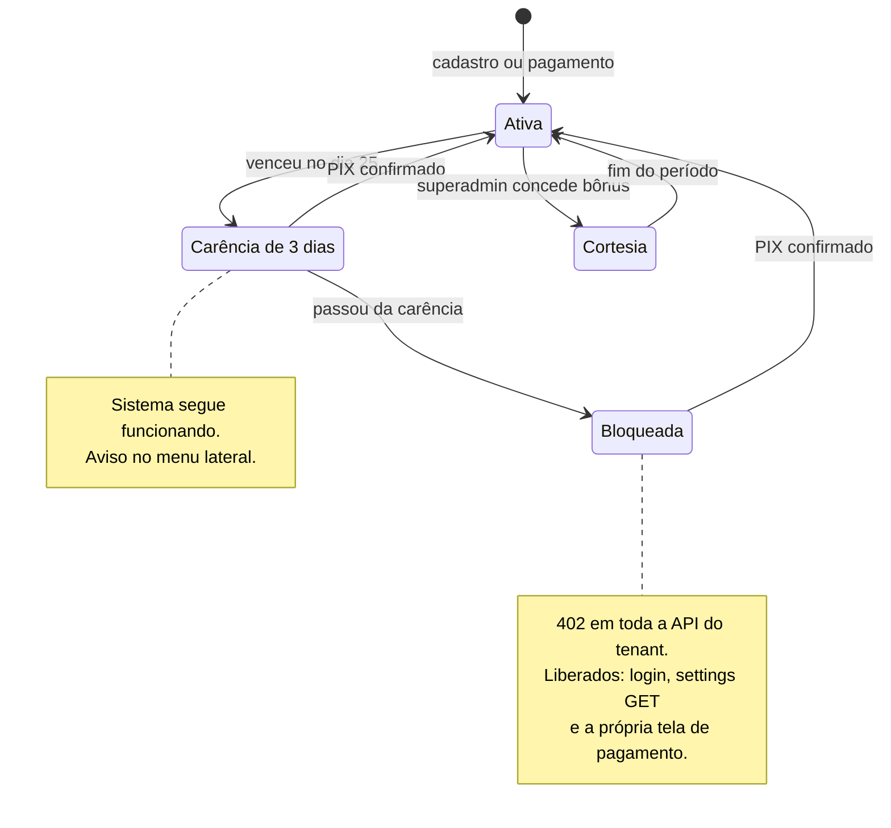
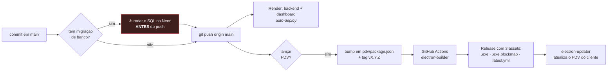
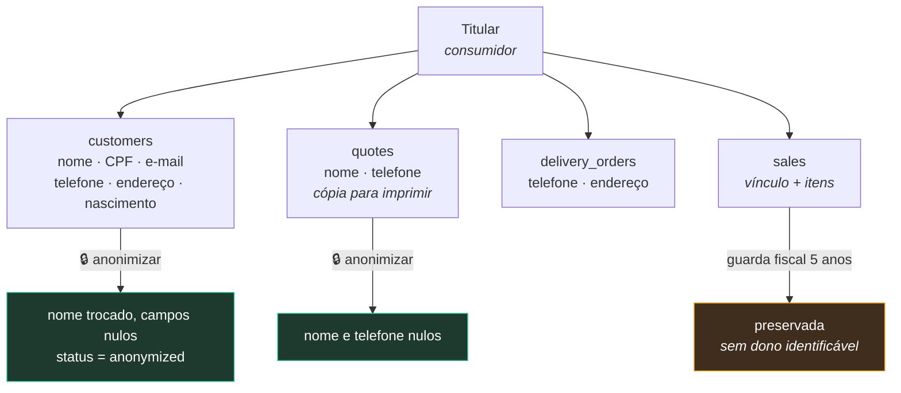

# Arquitetura e fluxos — SOLUÇÃO 2026

> Diagramas do sistema em funcionamento. Última revisão: **08/08/2026**.
> Os diagramas são Mermaid — o GitHub renderiza direto no navegador.
>
> Quem chega agora deve ler nesta ordem: **§1 (peças)** → **§2 (isolamento
> entre lojas)** → **§3 (venda)**. O resto é consulta.

---

## 1. Peças e como conversam



**A decisão que molda tudo:** o PDV é *offline-first*. Ele nunca depende da
nuvem para vender — a venda é gravada no SQLite local e sincronizada depois.
Internet caindo no meio do movimento não pode parar a fila do caixa.

A única exceção é o **orçamento**, que precisa do servidor para receber
número sequencial. Está documentado como limitação conhecida em §5.

---

## 2. Isolamento entre lojas (multi-tenant)

Cem lojas dividem o mesmo banco. O que impede a loja A de ver os dados da
loja B **não é código de aplicação** — é política do PostgreSQL.



Três regras que sustentam isso — quebrar qualquer uma derruba o isolamento:

| Regra | Por quê |
|---|---|
| `SET LOCAL`, não `SET` | `LOCAL` morre no fim da transação. Sem isso, uma conexão devolvida ao pool levaria o contexto da loja anterior para a próxima request. |
| Role `solucao_app` sem `BYPASSRLS` nem superuser | Superuser ignora policy. É o erro de configuração mais comum em multi-tenant com RLS. |
| Host **direto** do Neon, nunca o `-pooler` | O pooler em modo transação não preserva `set_config` entre o SET e a query. O RLS passa a filtrar por um contexto vazio. |

O `tenant_id` **nunca** viaja na URL nem em header — só na claim assinada do
JWT. Um cliente malicioso não consegue pedir dados de outra loja porque não
existe parâmetro para isso.

---

## 3. Uma venda, do bipe ao servidor



**Idempotência:** cada venda carrega um `OfflineSyncId` (UUID gerado no PDV).
O servidor ignora um `OfflineSyncId` que já viu. Por isso reenviar o lote
inteiro é seguro — e é justamente o que acontece quando a rede cai no meio da
sincronização.

**Estoque pode ficar negativo no servidor.** É proposital: duas vendas
offline em caixas diferentes podem passar do saldo conhecido. O servidor
registra a realidade em vez de rejeitar uma venda que já foi feita e paga.

---

## 4. Ciclo do orçamento

O caso do balcão de autopeças: monta a lista, imprime, o cliente leva o papel
e volta dias depois.



A conversão viaja **dentro do próprio sync da venda** (`SaleSyncDto.QuoteId`),
não num endpoint separado. Assim funciona igual quando o PDV fechou a venda
offline e só sincronizou horas depois.

---

## 5. Devolução, vale crédito e o dinheiro do cliente



O saldo é abatido **em dois lugares**: no servidor (dentro da transação da
venda) e no SQLite local. Sem a baixa local, o operador gastaria o mesmo vale
várias vezes até o próximo snapshot do catálogo.

---

## 6. Quem pode o quê



O caixa **executa**; quem responde pela loja **autoriza**. As três ações que
tiram dinheiro ou mercadoria — desconto acima da alçada, sangria e devolução —
exigem código + PIN de um `admin` ou `manager`, validados **no servidor**.
Quem liberou fica gravado no motivo do lançamento e no `audit_log`.

---

## 7. Assinatura do lojista



O primeiro ciclo é **pro-rata** até o dia 25. O provider de PIX é plugável
(`Billing:Provider`): `simulated` confirma sozinho em ~20s para teste;
`mercadopago` usa o token real.

---

## 8. Do commit ao caixa do cliente



**A ordem não é preferência, é requisito.** O EF mapeia a coluna nova assim
que o código sobe; se ela ainda não existe no banco, toda consulta àquela
tabela responde 500. Não há migração automática no startup — cada
`database/NN_*.sql` é aplicado à mão no SQL Editor do Neon.

Os 3 assets da release são obrigatórios: sem o `latest.yml` o
`electron-updater` não enxerga a versão nova.

---

## 9. Onde os dados pessoais moram (LGPD)



Anonimizar em vez de excluir é o que concilia o **art. 18, VI** (eliminação)
com a guarda fiscal obrigatória de 5 anos. Detalhamento completo, incluindo o
que ainda falta no plano jurídico, em [LGPD.md](LGPD.md).

---

## 10. Mapa do repositório

```
solucao-2026/
├── backend/              .NET 9 · 21 controllers
│   ├── Controllers/      Auth, Products, Sales, Sync, Cash, Quotes, Returns…
│   ├── Middleware/       TenantMiddleware · SubscriptionGate
│   ├── Data/             AppDbContext · TenantConnectionInterceptor (RLS)
│   └── Services/         Jwt · Audit · OperatorAuth · Billing/ · Fiscal/
├── dashboard/            React + Vite + Tailwind · 15 páginas
├── pdv/                  Electron offline-first
│   ├── electron/         main · preload · db (SQLite) · sync · print · updater
│   └── src/              PDV.jsx + modais (pagamento, orçamento, devolução…)
├── database/             01…19 · aplicados À MÃO, em ordem
├── backend.Tests/        xUnit · 139 testes · rodam sem Postgres
└── docs/                 ARQUITETURA (este) · DEPLOY · LGPD · MANUAL_TECNICO
```

> ⚠️ **Colisão de numeração:** existem `17_discount_default.sql` e
> `17_payment_methods.sql`. Ambos já aplicados em produção; ficam como estão
> para não quebrar o histórico. O próximo número livre é o **20**.
